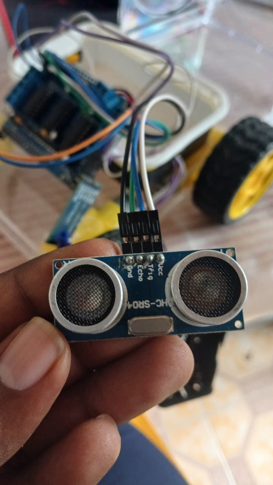
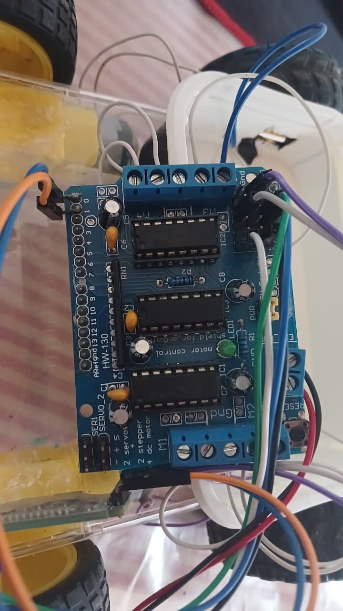
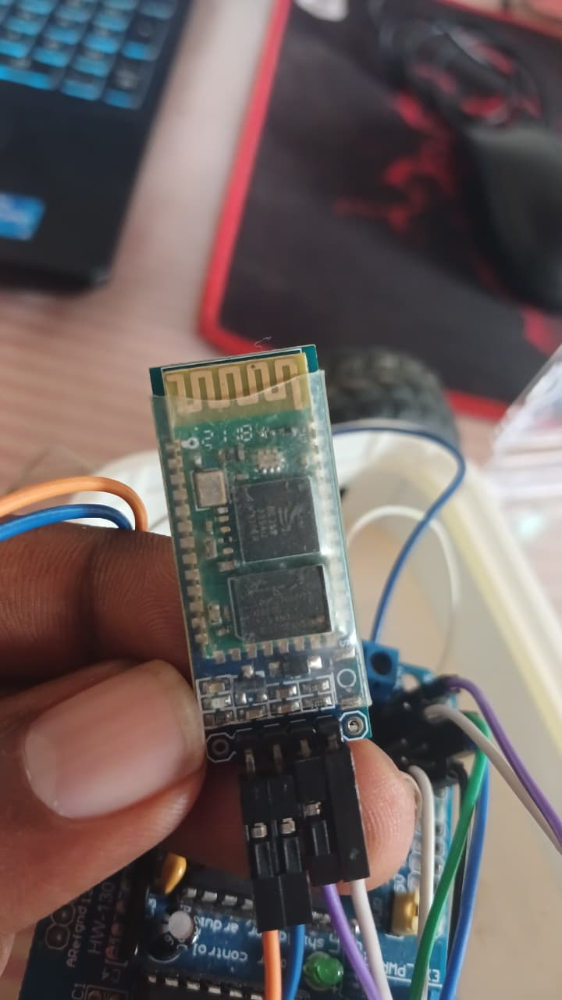
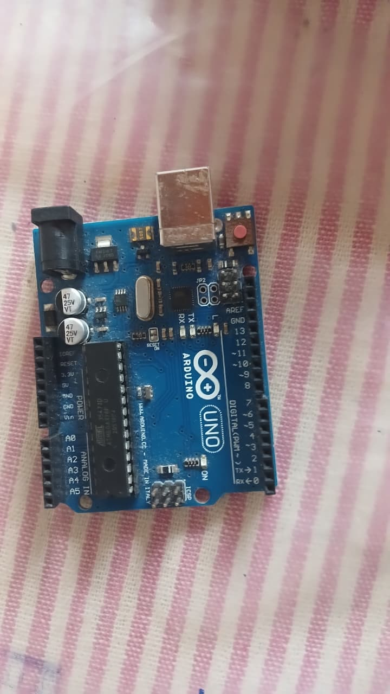

# Autonomous 4WD Obstacle Avoidance Rover 🤖🚘

A compact, fully autonomous 4-wheel-drive rover built with an Arduino Uno and an L293D motor shield. This project utilizes an HC-SR04 ultrasonic sensor to actively scan its environment, detect obstacles in real-time, and navigate complex paths without human intervention. 

Instead of basic stop-and-reverse mechanics, the rover employs a custom **"Spin-Scan"** decision-making algorithm and **skid-steering** logic to evaluate clearances on both sides before choosing the optimal escape route.

## 📸 Hardware Showcase

Here is a closer look at the rover's component assembly and wiring setup:

  
  

  
  

## 🌟 Key Features

* 🤖 **Fully Autonomous Navigation:** Navigates independently using real-time spatial data.
* 🔄 **Spin-Scan Algorithm:** Automatically stops at obstacles, physically rotates to measure left and right clearances, and intelligently turns toward the most open path.
* 🏎️ **Skid-Steering:** Utilizes inverted motor pairing for smooth, zero-radius turns on the spot.
* 🛡️ **Failsafe Mechanisms:** Includes sensor timeouts and trapping-recovery logic (automatic 180-degree U-turns when cornered in a dead end).

## 🛠️ Hardware Stack

* **Microcontroller:** Arduino Uno 
* **Motor Driver:** L293D Motor Drive Shield
* **Actuators:** 4x DC Gear Motors (4WD configuration)
* **Sensors:** HC-SR04 Ultrasonic Sensor
* **Power Supply:** 7V external battery pack for motors

## 🔌 Wiring Guide

| Component | L293D Shield / Arduino Pin |
| :--- | :--- |
| **Left Motors** | `M1` & `M2` Terminals |
| **Right Motors** | `M3` & `M4` Terminals |
| **HC-SR04 VCC** | `5V` |
| **HC-SR04 GND** | `GND` |
| **HC-SR04 Trig** | `Analog 1 (A1)` |
| **HC-SR04 Echo** | `Analog 2 (A2)` |

## 🚀 Installation & Usage

1.  **Dependencies:** Install the [Adafruit Motor Shield V1 library](https://github.com/adafruit/Adafruit-Motor-Shield-library) via the Arduino IDE Library Manager.
2.  **Upload:** Connect your Arduino Uno to your PC and upload the provided `.ino` file. *(Note: Ensure any RX/TX serial modules are unplugged during upload).*
3.  **Calibration:** Place the rover on the target operating surface. Adjust the `const int turnTime = 400;` variable in the code to ensure the rover rotates exactly 90 degrees during its scanning phase. Higher friction surfaces (like carpet) will require a higher millisecond value.
4.  **Run:** Power on the rover. It has a built-in 3-second delay on startup to allow you to place it safely on the ground before it begins its autonomous loop.
